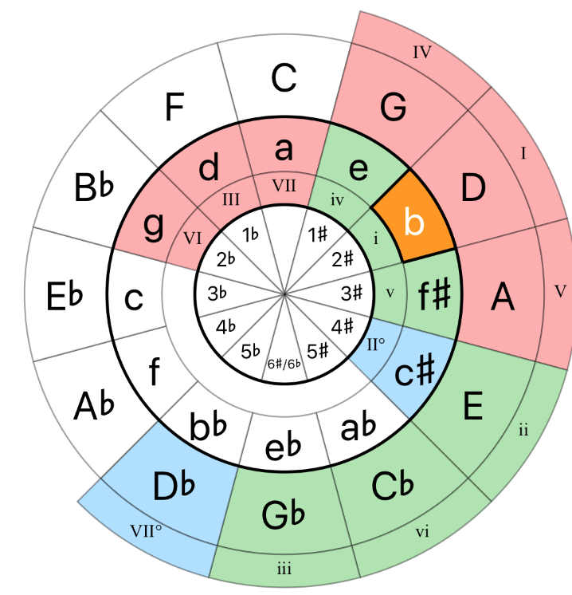

**Circle of Fifths**

Almost all of music theory is based on the major scale interval pattern, W W H W W W H. Here a major pattern emerges in the fifth note of the scale. 

Order of sharps: F C G D A E B (Fat Cats Get Drunk At Eddie's Bar)
Order of flats: B E A D G C F (BEAD GCF)

- All notes in the major scale of the Fifth note has the same notes as the root, except one note. For example, C major(12 o clock. 12 - 12 = 0) has no sharps or flats in its scale. Fifth of C is G. G (1 o clock, 1 - 12 = 1 (modular)) has only one sharp in its scale, F (ie F#). Fifth of G is D, which has two sharps in its scale, F and C (ie F# & C#).

-  As we progress through each fifth note scale, there's a universal order to which notes are sharps and flats. This is called the order of sharps and flats. 
    - As we progress clockwise, from 12 o clock to 6 o clock, we add sharps. We start reading from the 11 o clock position, ie F. For example, A major is at 3 o clock, so starting from F, it will have 3 sharps, ie F, C and G. 
    Following this logic, in E major which is at 4 o clock, we will add 4 sharps from F, ie F, C, G, D.
    - Once we reach 7 o clock, we need to move to the order of flats. Instead of counting up, we're gonna count down. Db is at 7 o clock. 12 - 7 = 5. So start counting from 5 o clock and go backwards 5 steps. Flats are B, E, A, D, G.
    - The letter under the major scale notes are the relative minor notes (sixth scale notes). Relative minor scales (vi) have the same notes as the root major scale (I). For example, notes in Am and C are the same.  

**Exercise:** (sharps = 12 - flats / flats = 12 - sharps)

1. 12 o clock -> C. 12 - 12 = 0. So C has 0 sharps or flats.  
2. 1 o clock -> G (V of C). In the order of sharps, 1 o clock = 13. So 13 - 12 = 1. G has 1 sharp. F#, starting from 11 o clock.  
3. 2 o clock -> D (V of G). In order of sharps, 2 o clock - 12 o clock = 2. 2 sharps, F# and C#. 
4. 3 o clock -> A (V of D). 3 o clock - 12 o clock = 3. From F, there will be 3 sharps, ie F#, C#, G#. 
5. 4 o clock -> E (V of A). 4 o clock - 12 o clock = 4. From F, 4 sharps, ie, F#, C#, G#, D#. (4 sharps / 8 flats)
6. 5 o clock -> B (V of E). 5 o clock - 12 o clock = 5. From F, 5 sharps, F#, C#, G#, D#, A#. (5 sharps / 7 flats)
7. 6 o clock -> F# (V of B). 6 o clock - 12 o clock = 6. From F, 6 sharps. F#, C#, G#, D#, A#, E#. (6 sharps / 6 flats)

Rule changes (Only for convenience, too many sharps now) To calculate flats, move the other way than the sharps:

8. 7 o clock -> Db (V of F#). 12 - 7 = 5. 5 flats, B,E,A,D,G
9. 8 o clock -> Ab (V of Db). 12 - 8 = 4. 4 flats, B,E,A,D
10. 9 o clock -> Eb (V of Ab). 12 - 9 = 3. 3 flats, B,E,A
11. 10 o clock -> Bb (V of Eb). 12 - 10 = 2, 2 flats, B,E
12. 11 o clock -> F (V of Bb). 12 - 11 = 1, 1 flat, B.